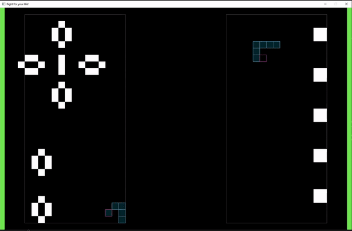

# fight-for-your-life

A 2-player game based on the "Conway's Game of Life", made with Rust and the game engine "ggez". 
Create shapes on the grid that will expand and hit your opponent's life bar, while defending yours, to win!

You can download and run the binary in the "executable" folder or you can build it yourself using the Rust compiler.

